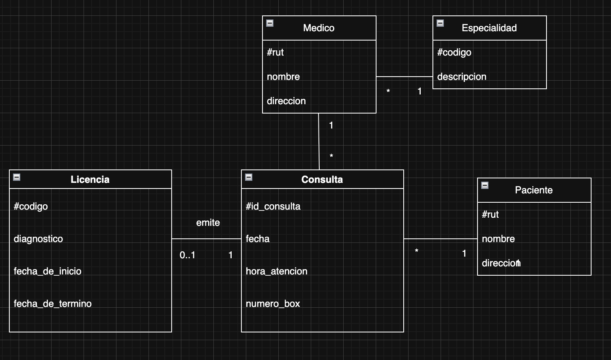

# datos_relacionales
desafío_modulo_5

## Consultas Médidas##

## objetivos del ejercicio ##

Modelo entidades relacion y modelo relacional
1. Consulta con fecha, hora y numero
2. Paciente con nombre, rut y dirección
3. Médico entrega licencia o no
4. Licencia id, diagnóstico, fecha i y f

## Diagrama##

## Modelo Relacional ##
Las tablas creadas son:

- **especialidad**  
  (`codigo_especialidad` PK, `descripcion`)

- **medico**  
  (`rut_medico` PK, `nombre`, `direccion`, `codigo_especialidad` FK)

- **paciente**  
  (`rut_paciente` PK, `nombre`, `direccion`)

- **licencia**  
  (`codigo_licencia` PK, `diagnostico`, `fecha_inicio`, `fecha_termino`)

- **consulta**  
  (`id_consulta` PK, `fecha`, `hora_atencion`, `numero_box`,  
  `rut_medico` FK, `rut_paciente` FK, `codigo_licencia` FK opcional y única)

## Archivos del proyecto##
- `schema.sql` → Estructura de la base de datos (modelo relacional).
- `seed.sql` → Datos de ejemplo para pruebas.
- `queries.sql` → Consultas de verificación.

